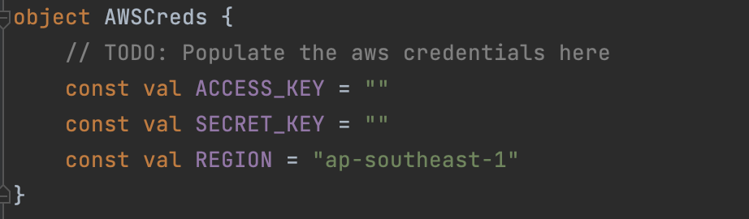
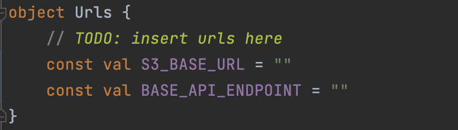

# GrubPool
### SMU CS461 Project by G2T10

---
# Environment setup
- Navigate to the `local.properties` file and include the following environment variables
- To generate a Google Maps api key, follow the guide in this [link](https://developers.google.com/maps/documentation/embed/get-api-key#:~:text=Go%20to%20the%20Google%20Maps%20Platform%20%3E%20Credentials%20page.&text=On%20the%20Credentials%20page%2C%20click,Click%20Close)
```
sdk.dir={absolute_path_to_your_android_sdk}
MAPS_API_KEY={your_generated_google_maps_api_key}
```
- Populate the AWSCreds and Urls object model with your personal credentials
  - Located under `app.src.main.java.cs461.g2t10.grubpool.data.models`
  
  
---
# Runtime environment
- Ensure that your emulator/physical device is running on  ***API 33***
- Recommended screen size `6.4"` `1080x2400` `420dpi`
  - A Google Pixel 6 emulator should do the work